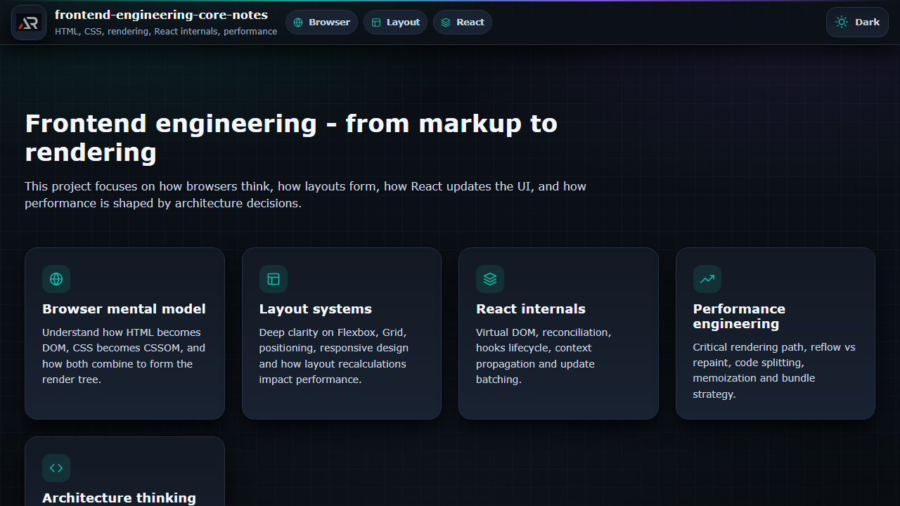

# Frontend Engineering Core Notes

A structured single-page revision guide for frontend engineering. It covers browser internals, HTML, CSS layout, responsive design, React internals, rendering, architecture, and performance.



## Features

- Topic-based notes for fast revision
- Browser rendering, layout, reflow, repaint, and performance concepts
- React internals, reconciliation, hooks, context, code splitting, and optimization
- Dark and light themes with local persistence
- Responsive fixed header, local logo, and floating go-to-top button

## Tech stack

React, Vite, styled-components, React Icons, and pure CSS.

## Run locally

```bash
npm install
npm run dev
```

## Build and deploy

```bash
npm run build
npm run deploy
```

Live demo: [a2rp.github.io/frontend-engineering-core-notes](https://a2rp.github.io/frontend-engineering-core-notes/)

## Links

- Portfolio: [https://www.ashishranjan.net](https://www.ashishranjan.net)
- GitHub: [https://github.com/a2rp](https://github.com/a2rp)
- CodePen: [https://codepen.io/ash1198](https://codepen.io/ash1198)
- LinkedIn: [https://www.linkedin.com/in/aashishranjan](https://www.linkedin.com/in/aashishranjan)
- Facebook: [https://www.facebook.com/theash.ashish/](https://www.facebook.com/theash.ashish/)
- YouTube: [https://www.youtube.com/@ashishranjan-ashz?sub_confirmation=1](https://www.youtube.com/@ashishranjan-ashz?sub_confirmation=1)
- Email: [ash.ranjan09@gmail.com](mailto:ash.ranjan09@gmail.com)

## Support

- Support: [https://a2rp-donation-page.netlify.app/](https://a2rp-donation-page.netlify.app/)
- Buy Me a Coffee: [https://buymeacoffee.com/a2rp](https://buymeacoffee.com/a2rp)
- Patreon: [https://patreon.com/a2rp](https://patreon.com/a2rp)
