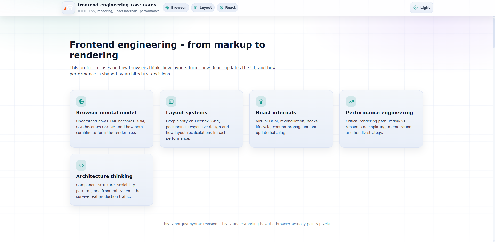

# Frontend Engineering Core Notes

A single-page, at-a-glance revision project for deep frontend engineering concepts.

This project is designed as a structured, no-fluff reference covering browser internals, rendering systems, layout architecture, and advanced React fundamentals.  
It focuses on clarity, performance mindset, and production-ready thinking.

---

---

## Purpose

- Fast revision before interviews
- Strong mental model of how browsers actually work
- Deep understanding of layout and rendering systems
- Advanced React internals explained clearly
- Performance-first frontend mindset

---

## Coverage

### HTML Deep

- Semantic elements
- Accessibility (A11y)
- SEO fundamentals
- Document structure
- ARIA basics
- Meta tags and indexing

### CSS Deep

- Layout systems
- Flexbox
- Grid
- Responsive design
- Media queries
- Animation and transitions
- Architecture patterns (BEM, modular thinking)

### Browser Internals

- DOM (Document Object Model)
- Browser rendering process
- Reflow vs repaint
- Critical rendering path
- Layout and paint phases
- Compositing layers

### React Deep

- Virtual DOM
- Reconciliation algorithm
- Hooks internals
- Context API
- Rendering lifecycle
- Performance optimization
- Memoization
- Code splitting
- Lazy loading
- Bundle optimization

---

## Mental Model Focus

This project emphasizes:

- How HTML becomes pixels
- How CSS affects rendering cost
- Why layout decisions impact performance
- How React schedules and updates UI
- When optimization is necessary
- What causes slow renders

---

## Tech Stack

- React (Vite)
- Styled Components
- Pure CSS architecture
- GitHub Pages deployment

---

## Live Demo

https://a2rp.github.io/frontend-engineering-core-notes/

---

## Who This Is For

- Frontend developers preparing for interviews
- Engineers wanting deeper browser knowledge
- React developers moving toward senior roles
- Developers who want to understand performance deeply

---

## Status

In progress - structured topic expansion ongoing.

---

## Philosophy

Frontend engineering is not just UI styling.  
It is understanding how the browser parses, calculates, paints, and optimizes.

The goal is not memorization.  
The goal is internalizing the rendering pipeline.

---

## Connect

Ashish Ranjan

- GitHub: https://github.com/a2rp
- Portfolio: https://www.ashishranjan.net
- LinkedIn: https://www.linkedin.com/in/aashishranjan
- Facebook: https://www.facebook.com/theash.ashish/
- Youtube: https://www.youtube.com/@ashishranjan-ashz

---

## License

MIT

## Links

- Portfolio: [https://www.ashishranjan.net](https://www.ashishranjan.net)
- GitHub: [https://github.com/a2rp](https://github.com/a2rp)
- CodePen: [https://codepen.io/ash1198](https://codepen.io/ash1198)
- LinkedIn: [https://www.linkedin.com/in/aashishranjan](https://www.linkedin.com/in/aashishranjan)
- Facebook: [https://www.facebook.com/theash.ashish/](https://www.facebook.com/theash.ashish/)
- YouTube: [https://www.youtube.com/@ashishranjan-ashz?sub_confirmation=1](https://www.youtube.com/@ashishranjan-ashz?sub_confirmation=1)
- Email: [ash.ranjan09@gmail.com](mailto:ash.ranjan09@gmail.com)

## Support

- Support: [https://a2rp-donation-page.netlify.app/](https://a2rp-donation-page.netlify.app/)
- Buy Me A Coffee: [https://buymeacoffee.com/a2rp](https://buymeacoffee.com/a2rp)
- Patreon: [https://patreon.com/a2rp](https://patreon.com/a2rp)